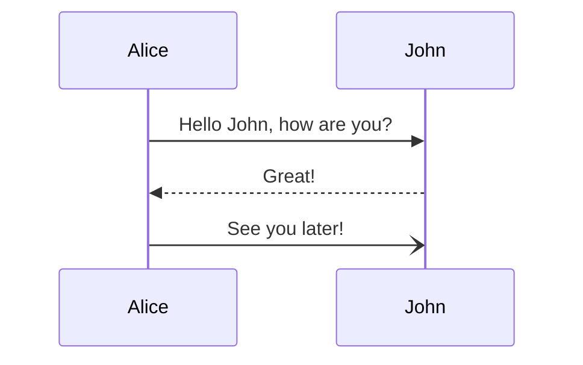
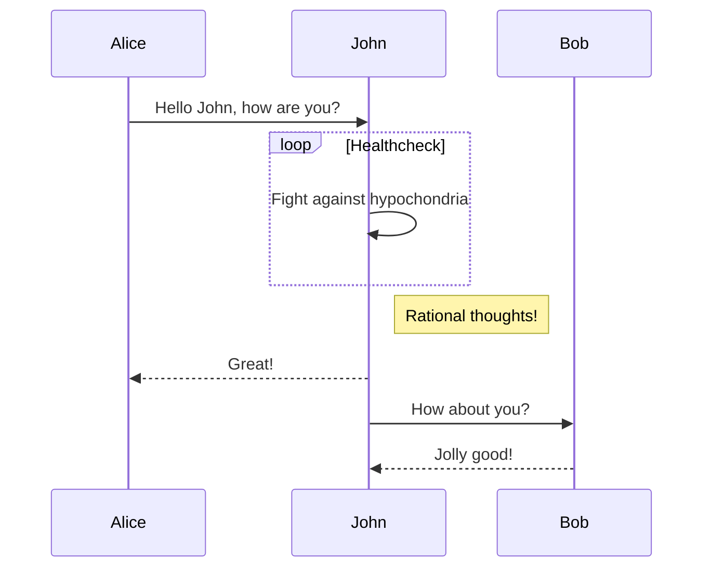

import { MermaidWrapper } from "@interledger/docs-design-system";

Use this component if your Mermaid diagram is much larger than our available space and you would like users to view the full diagram in another tab. This adds "View full diagram" button with an external link indicator on the bottom right corner under the diagram. Note that the `client:load` attribute is required for the functionality to work because this component uses Javascript for interactivity.

To use it, your docs page must be in `.mdx` format. Please change the format from `.md` to `.mdx` if necessary. All your existing markdown will still be supported without issue.

## Usage

Import the `MermaidWrapper` component like so:

```jsx
import { MermaidWrapper } from "@interledger/docs-design-system";
```

Use the `<MermaidWrapper>` component within your content like so:

{/* prettier-ignore */}
````jsx
<MermaidWrapper client:load>

</MermaidWrapper>
````

By default, there will be a border around the image, but if you want to remove the border, pass in a `hasBorder={false}` attribute.

{/* prettier-ignore */}
````jsx
<MermaidWrapper client:load hasBorder={false}>

</MermaidWrapper>
````

If you happen to be using some sort of format on save functionality in your code editor, like Prettier, it might sometimes screw up your formatting. You might want to ask Prettier to ignore your Mermaid block just in case.

```
{/* prettier-ignore */}
```

## Working example

:::caution
Live example is temporarily disabled because of a known yet unresolvable issue with the [remark-mermaidjs]() plugin's Playwright dependency causing a build failure in with our deployment pipeline. This issue always occurs when Playwright releases a new version, but our build runners keep looking for browser executables installed in an older folder version. Possibly because of caching? We have yet to find a way to manually clear the Github Actions cache, nor the Netlify cache.
:::

{/* prettier-ignore */}
{/* <MermaidWrapper client:load>


</MermaidWrapper> */}
